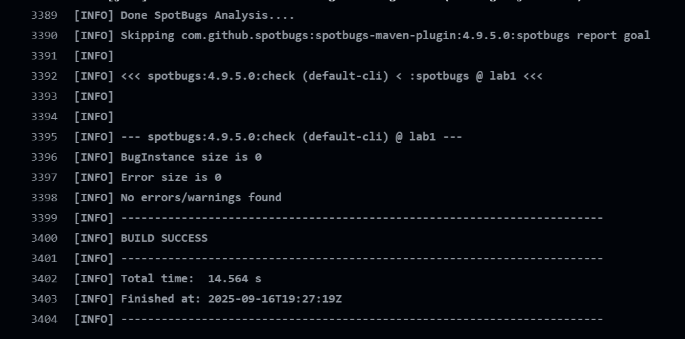
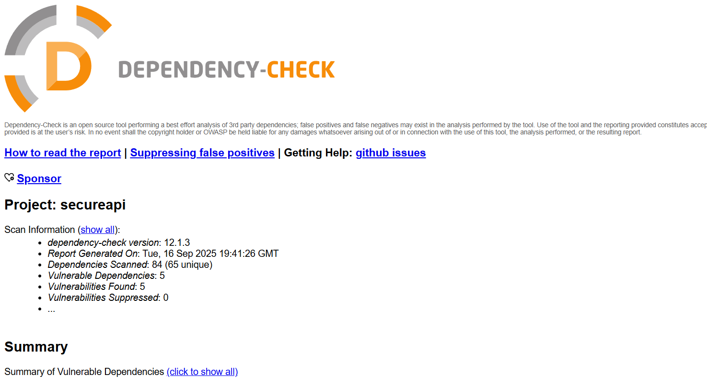

# Secure API (Lab1)


## Описание проекта
Проект демонстрирует разработку защищённого REST API на Spring Boot 3 / Java 17 с аутентификацией по JWT.  
Включает меры защиты от распространённых веб-уязвимостей, а также автоматическую проверку кода
через GitHub Actions


## API

### Аутентификация и регистрация
#### `POST /auth/register`

Регистрация нового пользователя.

**Request body:**
```json
{
  "username": "newuser",
  "password": "secret"
}
````

**Response 201:**

```json
{
  "message": "User registered successfully",
  "token": "<JWT токен>"
}
```

---

#### `POST /auth/login`

Авторизация существующего пользователя.

**Request body:**

```json
{
  "username": "newuser",
  "password": "secret"
}
```

**Response 200:**

```json
{
  "token": "<JWT токен>"
}
```

---

### Данные пользователей

Эндпоинт требует **Token** в заголовке `Authorization`.

#### `GET /api/data`

Возвращает список всех зарегистрированных пользователей:

**Headers:**

```
Authorization: Bearer <JWT токен>
```

**Response 200:**

```json
[
  {
    "id": 1,
    "username": "user1"
  },
  {
    "id": 2,
    "username": "user2"
  }
]
```

---

## Реализованные меры защиты

### SQL Injection

* Используется **Spring Data JPA**, который генерирует подготовленные SQL-запросы.
* Все параметры подставляются через bind-переменные, что исключает инъекции.

### XSS

* Все возвращаемые имена пользователей экранируются:

  ```java
  StringEscapeUtils.escapeHtml4(t.getUsername())
  ```

  что предотвращает внедрение HTML/JS кода в ответах.

### Аутентификация

* Авторизация через **JWT токен**:

  * При регистрации или входе генерируется токен (`JwtUtil.generateToken`).
  * Доступ к защищённым ресурсам только с валидным токеном в заголовке:

    ```
    Authorization: <token>
    ```
* Секретный ключ хранится в конфигурации и используется для подписи и валидации.
* Используется валидация входных данных (`@Valid` + Bean Validation).

---

## CI/CD и автоматический анализ безопасности

В репозитории настроен workflow GitHub Actions:

* **SpotBugs (SAST)** — статический анализ кода.
* **OWASP Dependency-Check (SCA)** — анализ зависимостей на наличие уязвимостей.




